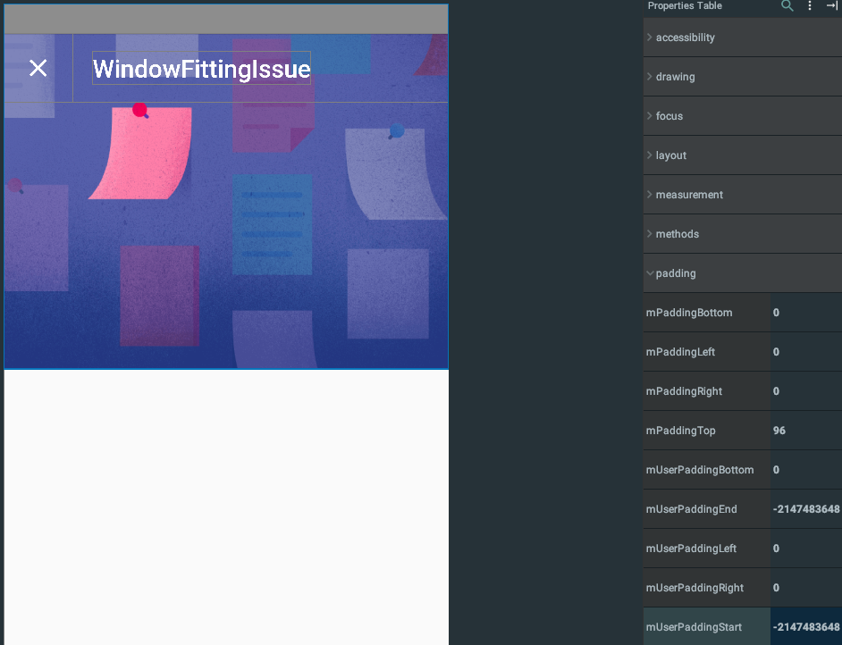

# windowfittingissue

demo app to demonstrate issue with padding applied to childs of CoordinatorLayout when setting `fitsSystemWindows=true`

When using a `FrameLayout` as root and manually setting Window Transformation Flags the Image gets displayed underneath the statusbar as expected.

The recent talk of @chrisbanes (https://photos.app.goo.gl/E09HOVX5duuFHXes1) suggested to use `CoordinatorLayout` which automatically
handles the WTFs but has a different
interpretation of `fitsSystemWindows` and the propagation to it's children.
Nevertheless the usage of `CoordinatorLayout` produces an unwanted top-padding of it's first child.

As shown in the above image, the ImageView itself is placed underneath the Statusbar but get's a top-padding set of 96px.

Please check the two different implementations:
- `master`: CoordinatorLayout
- `conventional`: FrameLayout with custom WTFs
